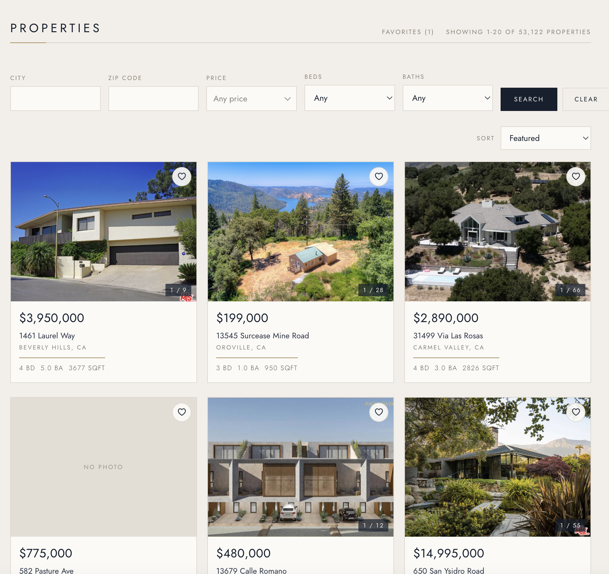

# idx-property-search

A property search app built on IDX real estate listing data. Browse and filter
listings, page through results, and open a detail page with photos, a map, and
open house times.

Node/Express + MySQL on the backend, React on the frontend.

> **Status:** still in progress. Most of it works; see Known issues at the bottom
> for what's rough.



## Team

Ana Clara · Shuwen Wen · Janie Tran · Westin Mathies · Ethan Li · Jenny Huynh

## Features

**Search and filtering** — filter by city, ZIP, price range, beds, and baths.
The price filter has a histogram showing where listings actually cluster, so you
can see the shape of the market before picking a range.

**Sorting** — price, date listed, square footage, or bed count. The sort sticks
when you change pages and resets when you change filters, since a new filter set
is a different list.

**Pagination** — 20 per page, done on the server so the browser never holds more
than a page. Page numbers collapse with an ellipsis on long result sets.

**Property detail page** — photos with a thumbnail strip and a full-screen
lightbox, a Google map, price and stats, description, and open house times.

**Favorites** — save properties with the heart on any card. Saved to the browser,
so they survive a refresh. There's a separate page listing them.

**Photo carousel on cards** — flip through a listing's photos without leaving the
results page.

## Tech stack

| | |
|---|---|
| Node | 24.x (18+ works) |
| Express | 5.2 |
| MySQL | 8.x — needs window function support |
| mysql2 | 3.22 |
| React | 19.2 |
| React Router | 6.30 |
| Create React App | 5.0.1 |
| Jest + Supertest | backend tests |
| Jest + React Testing Library | frontend tests |

No CSS framework, no component library, no state management library. Plain CSS
and React state.

## Setup

You'll need Node 18+ and MySQL running locally.

**1. Load the data**

```bash
mysql -u root -p -e "CREATE DATABASE rets"
mysql -u root -p rets < rets_property.sql
mysql -u root -p rets < rets_openhouse.sql
```

**2. Backend**

```bash
cd backend
npm install
```

Create `backend/.env`:

```
DB_HOST=localhost
DB_PORT=3306
DB_USER=root
DB_PASSWORD=your_password
DB_NAME=rets
PORT=5001
```

Port 5001, not 5000 — macOS AirPlay Receiver already uses 5000.

```bash
npm run dev
```

**3. Frontend**

```bash
cd frontend
npm install
npm start
```

Runs on port 3000 and proxies API calls to 5001.

For the map, create `frontend/.env`:

```
REACT_APP_GOOGLE_MAPS_API_KEY=your_key
```

Get a key from the Google Cloud console with the Maps Embed API enabled, and
restrict it to `localhost:3000`. Without a key everything still works — the map
just shows a placeholder. Restart the dev server after adding it.

**4. Optional: indexes**

```bash
mysql -u root -p rets < backend/sql/001-filter-indexes.sql
```

Speeds up filtered searches. See `backend/docs/performance.md`.

## API

Base path `/api/properties`.

| Endpoint | What it does |
|---|---|
| `GET /` | Paginated listings. Filters: `city`, `zipcode`, `minPrice`, `maxPrice`, `beds`, `baths`. Sort with `sortBy` (price, date, sqft, beds) and `sortOrder` (asc, desc). Paging with `limit` and `offset`. |
| `GET /:id` | One property, or 404. |
| `GET /:id/openhouses` | Open house events. Empty array if none. |
| `GET /price-distribution` | Price histogram for the filter slider. |
| `GET /api/health` | Database connection check. |

Example:

```
GET /api/properties?city=Palm Springs&minPrice=500000&sortBy=price&sortOrder=desc&limit=20
```

```json
{
  "total": 693,
  "limit": 20,
  "offset": 0,
  "results": [ { "L_ListingID": "1169421541", "L_Address": "696 S Warm Sands Drive", "...": "..." } ]
}
```

## Database

Two tables, joined on `L_ListingID`.

**rets_property** — one row per listing. Column names come from the RETS feed
and aren't obvious: `L_SystemPrice` is price, `L_Keyword2` is beds, `LM_Dec_3`
is baths, `LM_Int2_3` is square feet. `L_Photos` is a JSON array stored as text.

**rets_openhouse** — open house events. Remarks aren't a column; they're inside
the `all_data` JSON blob under `OpenHouseRemarks`.

## Project layout

```
backend/
  routes/      API endpoints
  utils/       query building, sort whitelist
  middleware/  request logging
  sql/         index migrations
  docs/        performance notes

frontend/src/
  api/         the only place that calls fetch
  pages/       listings, detail, favorites — own the state
  components/  presentational, props in and callbacks out
  hooks/       useFavorites
  utils/       parsing and formatting, no React
```

## Commands

```bash
npm run dev     # backend, port 5001
npm start       # frontend, port 3000
npm test        # frontend tests
npm run lint    # frontend linter
npm run build   # production build
```

## Git workflow

Work goes on a feature branch off `develop`, then merges back. Nothing commits
straight to `main`. Commit messages use `type(scope): description` — types are
feat, fix, refactor, test, docs, chore.

## Testing

```bash
cd backend  && npm test           # 16 tests
cd frontend && CI=true npm test   # 54 tests
```

Coverage sits around 88% on the backend routes and 84% on the frontend. Add
`npm run test:coverage` on the backend for the full report.

The backend tests mock the database connection, so they run in under a second
and work with MySQL turned off.

## Known issues

The feed data is messy and the app works around it:

- Some listings have no photos, or photo data that isn't valid JSON
- Price, beds, and baths can be null
- Missing lat/lng on some properties, so the map only renders when both exist
- Only about 1% of listings have open houses, so most detail pages show none

Things we know aren't great yet:

- **Filters don't live in the URL.** Going back from a detail page dumps you on
  page 1 with filters cleared, and you can't share a filtered search. Moving
  filter state into query params would fix both.
- **The favorites page fetches one property at a time.** Fine for five, slow for
  fifty. Needs a batch endpoint.
- **Favorites are per browser.** They're in localStorage, so they don't follow
  you to another device. Real accounts would.
- **No loading state on the detail page images.** Large photos pop in.
- **The composite indexes in `backend/sql/` aren't applied by default.** You have
  to run the migration yourself.

## Future improvements

Roughly in the order we'd do them:

1. Filter state in the URL, so searches are shareable and the back button works
2. A batch endpoint so favorites load in one request
3. Map pins on the listings page, not just the detail page
4. Saved searches with email alerts
5. Deploy it somewhere — currently local only
